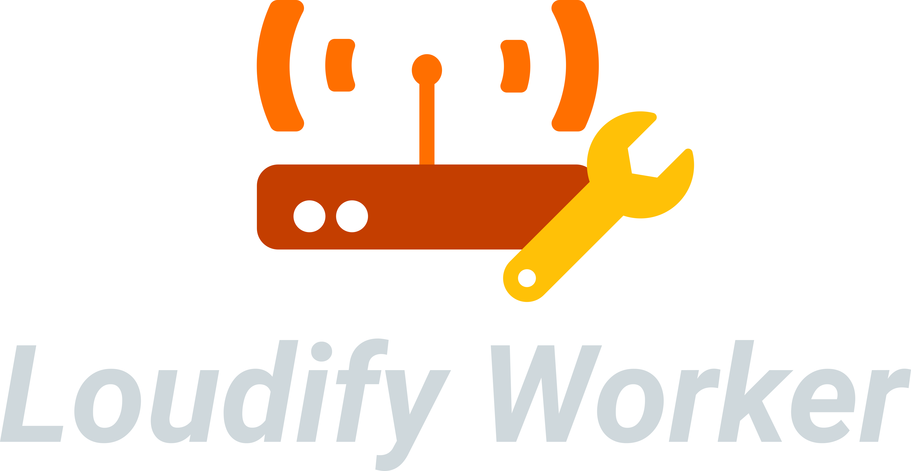

# loudify-worker

> Running a GNU Radio flowgraph as a ZMQ worker.

<!-- 

 -->

<!-- PROJECT LOGO -->
 

  

  <h3 align="center">Loudify - worker</h3>

  

    Loudify worker, running gnuradio flowgraph as a ZMQ worker.
     
    <a href="https://martynvdijke.github.io/loudify-worker/html/index.html"><strong>Explore the docs »</strong></a>
     
     
    <a href="https://github.com/martynvdijke/loudify-worker/issues">Report a bug</a>
    <a href="https://github.com/martynvdijke/loudify-worker/issues">Request a feature</a>
  

## Summary
This project is a worker for the ZMQ broker - worker setup for LoRa and part of a larger project, see [broker](https://github.com/martynvdijke/loudify-broker) and [gr-lora_sdr](https://github.com/martynvdijke/gr-lora_sdr).

## Contributing

Pull requests are welcome. For major changes, please open an issue first to discuss what you would like to change.
Make sure to add or update tests as appropriate.

## [Changelog](CHANGELOG.md)
